  

<h1 align="center">Hi 👋, I'm Raghul L</h1>

QA Automation Engineer • Java Developer • AI Test Engineering

Building enterprise-grade QA automation frameworks and AI-powered testing solutions.

&nbsp;

---

# 🚀 Featured Project

## AI Test Engineering Platform

Enterprise AI-powered Test Engineering Platform that combines intelligent requirement analysis with UI automation, API testing, database validation and enterprise reporting.

### ✨ Highlights

- AI Requirement Analysis
- AI Scenario Generation
- AI Test Case Generation
- Selenium UI Automation
- REST API Automation
- Database Validation
- Enterprise Reports

### 🛠 Core Skills

> **Testing:** Manual Testing • Selenium • TestNG • REST Assured • SQL

---

# 📌 Current Focus

- Building AI Test Engineering Platform
- Improving QA Automation Frameworks
- Learning Enterprise Test Architecture
- Open Source Contributions

---

### Thanks for visiting my profile! ⭐

